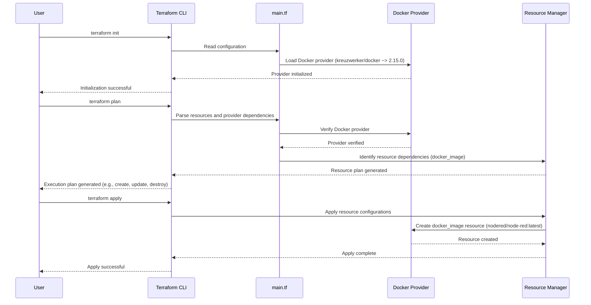

# Terraform Apply

## Table of Contents

- [Introduction](#introduction)
- [Node Red Application](#node-red-application)
- [Terraform](#terraform)
- [Docker](#docker)
- [Terraform Dependencies](#terraform-dependencies)
- [Creating Docker Image](#creating-docker-image)
- [Terraform Commands](#terraform-commands)
- [Conclusion](#conclusion)
- [References](#references)

## Introduction

Welcome to this guide, where we'll dive into deploying an application using Terraform, an open-source Infrastructure as Code (IaC) software tool. 

In this guide, we'll walk you through the deployment of an application called Node Red. No worries if you're unfamiliar with Node Red, we'll be covering it in brief, and the primary focus here will remain on Terraform.

## Node Red Application

Node Red is a flow-based development tool that is often used in IoT projects. For our demonstration, we will be deploying Node Red using Docker. For more information on Node Red, please refer to their official [documentation](https://nodered.org/docs/).

## Terraform

We'll be using HashiCorp's Terraform to deploy our Node Red application. Terraform allows you to define and provide data center infrastructure using a declarative configuration language. It helps in the efficient management of services and allows you to treat infrastructure like code, hence the term Infrastructure as Code (IaC).

## Docker

Docker is a tool designed to ease the process of creating, deploying, and running applications by using containers. In our case, we'll be deploying a Node Red container using Docker.

## Terraform Dependencies



## Creating Docker Image

We will first create a Docker image using the Node Red Docker Hub repository. The Docker image name will be `nodered/node-red:latest`, which we'll define in our `main.tf` Terraform configuration file. 

Below is an example of what the `main.tf` file looks like:

```hcl
terraform {
  required_providers {
    docker = {
      source = "kreuzwerker/docker"
      version = "~> 2.15.0"
    }
  }
}

provider "docker" {}

resource "docker_image" "nodered_image" {
  name = "nodered/node-red:latest"
}
```

Inside the resource block, we have:

```hcl
name = "nodered/node-red:latest"
```

- `name`: This is an attribute of the Docker image resource. It specifies the name of the Docker image we want to use or create.

- `"nodered/node-red:latest"`: This is the value assigned to the `name` attribute. It represents the name of the Docker image, in this case, "nodered/node-red:latest". The format is typically `<repository>/<image>:<tag>`, where the repository is the source or organization, the image is the specific Docker image, and the tag represents the version or variant. In this example, we're using the latest version of the "nodered/node-red" image.

## Terraform Commands

Once the `main.tf` file is ready, we can execute various Terraform commands. Here is a list of commands you'll need to run:

- `terraform init`: Initialize your Terraform working directory. This should be executed in your working directory where your `main.tf` file resides.
- `terraform fmt -diff`: This command is used to rewrite Terraform configuration files to a canonical format and style.
- `terraform plan`: Generate and show an execution plan.
- `terraform apply`: Build or change the infrastructure as per the plan.

For example, after running `terraform apply`, the system will output the plan information. After confirming by typing `yes`, Terraform will start pulling the Docker image and create the necessary resources.

You can verify the image using the following command:

```bash
docker image ls
```

Expected output:

```plaintext
REPOSITORY         TAG       IMAGE ID       CREATED        SIZE
nodered/node-red   latest    a15fc0f4e930   8 months ago   475MB
```

## Conclusion

And there you have it! You have just deployed your first application with Terraform. This process has shown you how to define resources, deploy Docker containers, and manage your infrastructure using code. Keep practicing these steps and explore more of what Terraform can offer.

## References

- [Node Red Docker Hub](https://hub.docker.com/r/nodered/node-red/)
- [Terraform Docker Provider Documentation](https://registry.terraform.io/providers/kreuzwerker/docker/latest/docs/resources/image)
- [terraform apply](https://developer.hashicorp.com/terraform/cli/commands/apply)
- [terraform fmt](https://developer.hashicorp.com/terraform/cli/commands/fmt)