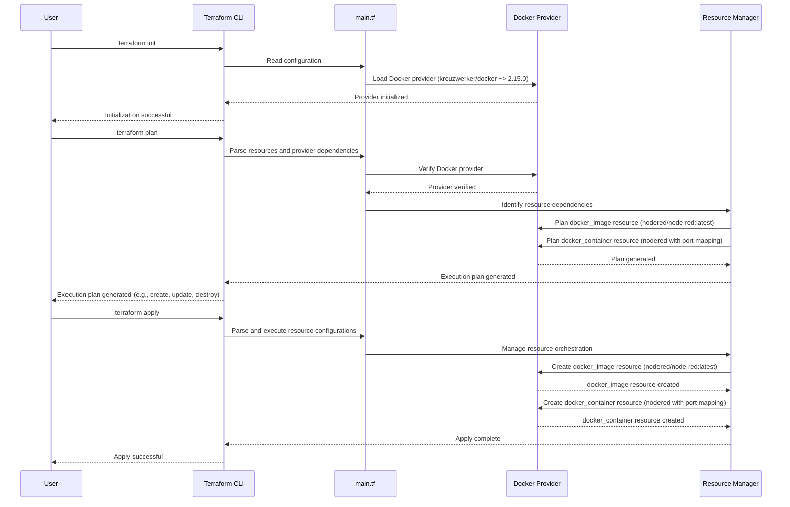

# Deploying Docker Container

Welcome to our Docker Deployment Tutorial, where we'll take you on a step-by-step journey to deploy your first Docker container, emphasizing how to reference values from other resources.

## Table of Contents

- [Introduction](#introduction)
- [Terraform Dependencies](#terraform-dependencies)
- [Deploying a Docker Container](#deploying-a-docker-container)
- [Referencing the Docker Image](#referencing-the-docker-image)
- [Creating and Naming a Resource](#creating-and-naming-a-resource)
- [Referencing the Docker Image Resource](#referencing-the-docker-image-resource)
- [Exposing Ports](#exposing-ports)
- [Running and Checking Your Deployment](#running-and-checking-your-deployment)
- [Conclusion](#conclusion)
- [References](#references)

## Introduction

Our main focus in this tutorial is to deploy a Docker container. We'll guide you on how to reference a Docker image and utilize it for deployment. The steps are designed to be straightforward, helping you to understand the core concepts without getting lost in the details.

## Terraform Dependencies



## Deploying a Docker Container

We start by deploying a Docker container. The official Docker documentation offers a wealth of examples and customization options. However, for this tutorial, we'll keep things simple. We'll deploy a Docker container based on the Node Red image that we previously downloaded.

## Referencing the Docker Image

To deploy a container, we need to reference the image we're going to use. The Docker documentation provides the image reference as `docker_image.<image-name>:latest`. We'll reference the Node Red image using the format `docker_image.nodered_image:latest`.

## Creating and Naming a Resource

Let's create a resource for the Docker container. In this case, the resource name is not critical and can be any logical value. It's merely a tag that can be referenced later if needed. We'll name the resource "nodered".

## Referencing the Docker Image Resource

Now we need to reference the Docker image resource in the container configuration. Here's how we do it:

```hcl
resource "docker_container" "nodered_container" {
  name = "nodered"
  image = docker_image.nodered_image.latest
}
```

In the `image` line, we're referencing the Docker image resource we created. `latest` is the only attribute available for the image resource, and it provides a unique identifier for the image.

## Exposing Ports

Since Node Red needs to be accessible externally, we need to expose some ports. Docker allows us to specify the internal and external ports for the container, and we'll map both to port 1880:

```hcl
resource "docker_image" "nodered_container" {
  name = "nodered"
  image = docker_image.nodered_image.latest

  ports {
    internal = 1880
    external = 1880
  }
}
```

The code is creating a Docker container based on an image called "nodered". An image is a pre-packaged software that contains all the necessary files and dependencies to run an application.

Here's what the code does step by step:

1. The line `resource "docker_image" "nodered_container"` tells Terraform that we want to create a resource of type "docker_image" and we'll refer to it as "nodered_container". This resource represents a Docker container.

2. `name = "nodered"` sets the name of the Docker image that will be used to create the container. In this case, the image name is "nodered". Think of it as the template for our container.

3. `image = docker_image.nodered_image.latest` specifies that we want to use the latest version of the "nodered" image. This line assumes that there is another resource named "nodered_image" which is of type "docker_image" and is defined in the Terraform configuration file using the following resource block:

```hcl
resource "docker_image" "nodered_image" {
  name = "nodered/node-red:latest"
}
```

By using the `latest` keyword, we ensure that the container will always use the most up-to-date version of the image.

4. The `ports` block is used to specify how the container will communicate with the outside world. Here, we are mapping port 1880 of the container's internal network to port 1880 of the host's external network. This means that if we access port 1880 on the host machine, it will be directed to the Node-RED application running inside the container.

Overall, this resource block creates a Docker container based on the "nodered" image and sets up port forwarding so that the application inside the container can be accessed from the host machine.

## Running and Checking Your Deployment

To deploy the infrastructure, follow the steps below:

### Step 1: Run Terraform Plan

Execute the following command to generate a Terraform plan:

```bash
terraform plan
```

The output will provide an overview of the changes that will be made to the infrastructure.

```js
Plan: 1 to add, 0 to change, 0 to destroy.
```

In this case, we will be adding one resource.

### Step 2: Review the Changes

Take a look at the planned changes and examine the attributes associated with the new resource. These attributes provide information that can be queried in the future.

For example, the following output shows the attributes of a Docker container resource named "nodered_container":

```js
+ resource "docker_container" "nodered_container" {
     + attach           = false
     + bridge           = (known after apply)
     + command          = (known after apply)
     + container_logs   = (known after apply)
     + entrypoint       = (known after apply)
     + env              = (known after apply)
     + exit_code        = (known after apply)
     + gateway          = (known after apply)
     + hostname         = (known after apply)
     + id               = (known after apply)
     + image            = "sha256:a15fc0f4e93018b7b6633639139a6fc1c6e13ca9275a6825cbecb6a4d2a85c57"
     + init             = (known after apply)
     + ip_address       = (known after apply)
     + ip_prefix_length = (known after apply)
     + ipc_mode         = (known after apply)
     + log_driver       = "json-file"
}
```

### Step 3: Examine the Ports

Next, review the port configurations for the container in the following output:

```js
+ ports {
     + external = 1880
     + internal = 1880
     + ip       = "0.0.0.0"
     + protocol = "tcp"
}
```

In this case, the container is configured to use port 1880 with TCP protocol and allow external connections from any IP address (0.0.0.0).

### Step 4: Apply the Changes

To apply the changes and deploy the infrastructure, execute the following command:

```bash
terraform apply
```

Review the proposed changes one more time and confirm the deployment by typing "yes" when prompted.

Wait for the deployment process to complete. Once finished, you will see the output indicating the successful execution of the deployment.

That's it! The infrastructure has been deployed using Terraform.

```js
Apply complete! Resources: 1 added, 0 changed, 0 destroyed.
```

After executing the Terraform apply command, the deployment process has completed successfully. As a result, two files have been generated: `terraform.tfstate` and `terraform.tfstate.backup`.

The `terraform.tfstate` file indicates that the state of the infrastructure has been modified. It serves as the primary source of truth for Terraform, capturing the current state of all resources managed by Terraform. This file should be treated as sensitive information and stored securely.

The `terraform.tfstate.backup` file is a backup copy of the previous state file. It provides an additional layer of safety in case the `terraform.tfstate` file becomes corrupted or lost. It is advisable to keep regular backups of the state file to ensure the ability to recover previous states if necessary.

**Note**: 

- These state files are crucial for Terraform to track and manage the deployed infrastructure. It's important not to modify or delete these files manually, as it can lead to inconsistencies between the desired and actual states of the infrastructure.

- By preserving these state files and following proper version control practices, you can ensure a reliable and maintainable infrastructure deployment process with Terraform.

After the deployment is complete, we can check the result of our deployment using the command `docker ps`:

```bash
docker ps
```

Output:

```plaintext
CONTAINER ID   IMAGE          COMMAND             CREATED              STATUS                        PORTS                    NAMES
2f4a414d949d   a15fc0f4e930   "./entrypoint.sh"   About a minute ago   Up About a minute (healthy)   0.0.0.0:1880->1880/tcp   nodered
```

## Conclusion

Great job! You've successfully deployed a Docker container and learned how to reference Docker images and expose ports for external access. Keep practicing these skills and explore other functionalities offered by Docker.

## References

- [Docker Documentation](https://docs.docker.com/)
- [Terraform Documentation](https://www.terraform.io/docs/)
- [Terraform Expressions](https://developer.hashicorp.com/terraform/language/expressions)
- [Terraform - Docker Container](https://registry.terraform.io/providers/kreuzwerker/docker/latest/docs/resources/container#nestedblock--ports)