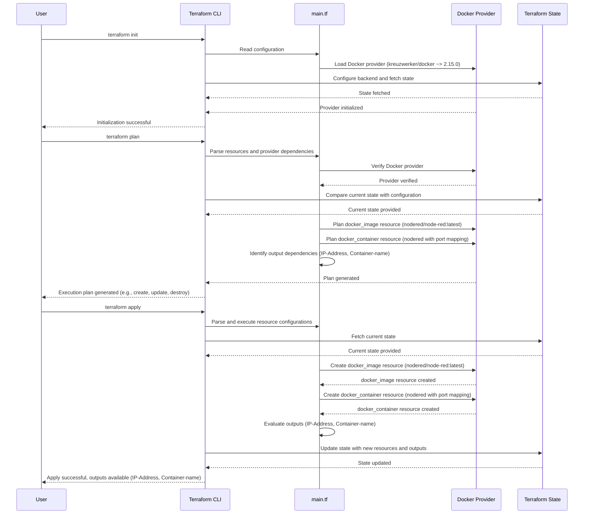

# Terraform Console and Outputs

Welcome to this comprehensive guide on utilizing outputs in Terraform. If you've ever found it challenging to display important metadata about your deployment, this guide will simplify the process for you, making it easy to understand. Outputs in Terraform allow us to export and modify state information from our deployment to be displayed on our terminal or consumed by other applications or Terraform modules. 

## Table of Contents

- [Introduction](#introduction)
- [Terraform Dependencies](#terraform-dependencies)
- [Application of Outputs](#application-of-outputs)
- [Accessing Attributes](#accessing-attributes)
- [Creating Output Values](#creating-output-values)
- [Displaying Outputs](#displaying-outputs)
- [Conclusion](#conclusion)
- [References](#references)

## Introduction

In order to understand and utilize Terraform outputs effectively, make sure you have applied the necessary state file for your Terraform deployment. This guide continues from the last lesson, assuming that the application of the state file has already been done. If not, apply it before continuing.

## Terraform Dependencies



## Application of Outputs

1. Once your deployment state is applied, you can use the `terraform show` command to view all the metadata about your deployed resources:

```bash
terraform show
```

2. Run the following command to display the IP-related information:

```bash
terraform show | grep ip
```

The command will search for lines containing the keyword "ip" in the Terraform state output and display the matching lines.

The output will show the IP address, IP prefix length, IPC mode, and other related information.

🎯 **Expected Output**:

```js
ip_address             = "172.17.0.2"
ip_prefix_length       = 16
ipc_mode               = "private"
global_ipv6_address    = ""
global_ipv6_prefix_length = 0
ip_address             = "172.17.0.2"
ip_prefix_length       = 16
ipv6_gateway           = ""
ip                     = "0.0.0.0"
```

3. Next, run the following command to display the name-related information:

```bash
terraform show | grep name
```

The command will search for lines containing the keyword "name" in the Terraform state output and display the matching lines.

The output will show the hostname, name, network name, and other related information.

🎯 **Expected Output**:

```js
hostname          = "69512c9488c7"
name              = "nodered"
network_name      = "bridge"
image_name        = "nodered/node-red:latest"
```

4. You can list all the resources that have been defined in your Terraform configuration using the following command:

```bash
terraform state list
```

🎯 **Expected Output**:

```js
docker_container.nodered_container
docker_image.nodered_image
```

## Accessing Attributes

If you want to access a specific attribute of your deployed resource, you can use the `terraform console` command. This command allows you to interact with the state of your deployed resources directly from the terminal. For instance, if you want to retrieve the name of your deployed Docker container, you can use the following command:

```bash
terraform console
> docker_container.nodered_container.name
"nodered"
```

Similarly, you can use the same method to retrieve the IP address of your deployed Docker container:

```bash
terraform console
> docker_container.nodered_container.ip_address
"172.17.0.2"
```

## Creating Output Values

1. In order to export these attributes from your script, you need to create an output value. The basic syntax for creating an output value includes the output name, value, and a description. Here's how to create an output for the IP address:

```hcl
output "IP-Address" {
  value = docker_container.nodered_container.ip_address
  description = "The IP address of the container"
}
```

And for the container name:

```hcl
output "Container-name" {
  value = docker_container.nodered_container.name
  description = "The name of the container"
}
```

**Note**:Please note that you cannot include spaces or special characters in the output name except for underscores, digits, or dashes.

2. Run the following command to apply your Terraform configuration and automatically approve any prompts:

```bash
terraform apply --auto-approve
```

🎯 **Expected Output**:

```js
Apply complete! Resources: 0 added, 0 changed, 0 destroyed.


Output:


Container-name = "node red"
IP-Address = "172.17.0.2"
```

## Displaying Outputs

3. After creating the output values, you can display them using the `terraform output` command:

```bash
terraform output
```

🎯 **Expected Output**:

```plaintext
Container-name = "nodered"
IP-Address = "172.17.0.2"
```

⛳️ Remember, these outputs will not exist until the state file is populated.

## Conclusion

Understanding and utilizing Terraform outputs can significantly streamline your deployment management process. With this guide, you should be able to access, create, and display your deployment's metadata easily. In the next lesson, we will delve further into the advanced aspects of Terraform.

## References

- [Terraform Console Documentation](https://developer.hashicorp.com/terraform/cli/commands/console)
- [Terraform Output Values Documentation](https://developer.hashicorp.com/terraform/language/values/outputs)
