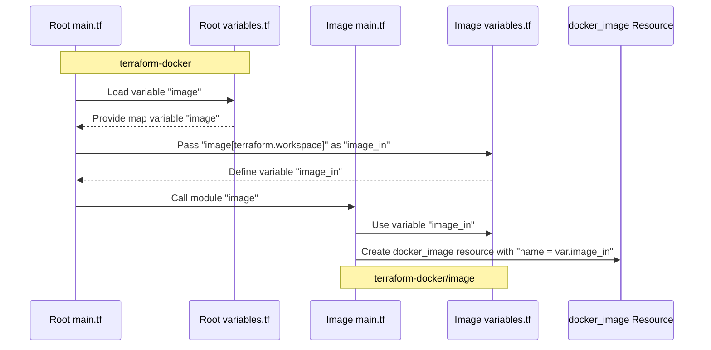

# Working with Terraform Module Variables

## Table of Contents

- [Introduction](#introduction)
- [Purpose and Scope](#purpose-and-scope)
- [Project Directory Structure](#project-directory-structure)
- [Root-Module Workflow](#root-module-workflow)
- [Setting Up Variables](#setting-up-variables)
- [Modifying the Module](#modifying-the-module)
- [Testing the Configuration](#testing-the-configuration)
- [Best Practices](#best-practices)
- [Key Takeaways](#key-takeaways)
- [Conclusion](#conclusion)
- [References](#references)

## Introduction

Welcome back! In this lesson, we are going to continue working on our Docker image module and enhance it by using variables. This will allow us to customize the module based on the environment, making our infrastructure more flexible and maintainable. By the end of this tutorial, you'll know how to pass variables from the root `main.tf` to the module, ensuring that our module's configuration remains immutable and easy to manage.

## Purpose and Scope

The purpose of this document is to guide you through the process of incorporating variables into your Terraform modules. This approach ensures that modules are immutable and any changes are managed centrally from the root configuration files. We'll demonstrate how to define and use variables to make our Docker image module dynamic, based on the workspace we're in.

## Project Directory Structure

The directory structure is organized as follows:

```
terraform-docker
├── central.tfvars
├── image
│   ├── main.tf
│   ├── outputs.tf
│   ├── providers.tf
│   └── variables.tf
├── main.tf
├── outputs.tf
├── providers.tf
├── terraform.tfvars
├── variables.tf
└── west.tfvars
```

## Root-Module Workflow

### Sequence diagram

Here's the sequence diagram in Mermaid that illustrates the interaction between the root `main.tf` and the module `image/main.tf`.



### Explanation

1. **Loading Variables in Root `main.tf`:**

- The root `main.tf` file defines a module named "image" with `source = "./image"`.
- It refers to a variable `var.image[terraform.workspace]`.

2. **Defining the `image` Variable in Root `variables.tf`:**

- The `variables.tf` file in the root directory defines a map variable `image` with default values for different environments (`dev` and `prod`).

3. **Passing Variables to the Module:**

- The root `main.tf` file passes the specific value of the `image` variable based on the current Terraform workspace to the `image_in` variable in the "image" module.

4. **Using the Variable in the Module `image/main.tf`:**

- The `image/main.tf` file in the "image" module defines a Docker image resource using the `image_in` variable.

5. **Creating the Docker Image Resource:**

- The `docker_image` resource is created with the name specified by `var.image_in`.

## Setting Up Variables

To begin, we need to ensure that our root configuration (`main.tf`) can pass variables to our module. Let's start by defining a variable in the root `variables.tf` file.

### Defining the Variable in the root `variables.tf`

Here, we define a map variable that holds the Docker image names for different environments:

```hcl
variable "image" {
  type = map(string)
  description = "Image for container"
  default = {
      dev = "nodered/node-red:latest"
      prod = "nodered/node-red:latest-minimal"
  }
}
```

This map variable allows us to specify different Docker images for different Terraform workspaces.

## Modifying the Module

Now that we have defined the variable in the root configuration, we need to modify our module to accept this variable.

### Passing the Variable to the Module

In the root `main.tf`, update the module block to pass the `image_in` variable:

```hcl
module "image" {
  source = "./image"
  image_in = var.image[terraform.workspace]
}
```

This code snippet ensures that the appropriate Docker image is selected based on the current Terraform workspace.

### Updating the Module's Configuration

Next, we need to update the module to use the `image_in` variable.

#### `image/variables.tf`

Add the following variable definition to the module's `variables.tf` file:

```hcl
variable "image_in" {
  description = "Name of the Docker image"
}
```

#### `image/main.tf`

Update the `docker_image` resource in the module's `main.tf` to use the `image_in` variable:

```hcl
resource "docker_image" "nodered_image" {
  name = var.image_in
}
```

## Testing the Configuration

With our variable setup complete, it's time to test our configuration to ensure everything is working as expected.

### Initialize Terraform

Run the following command to initialize your Terraform configuration and download the necessary providers:

```bash
terraform init
```

### Plan the Execution

Execute the `terraform plan` command to see the planned changes:

```bash
terraform plan
```

This command should show you that the Docker image name is being correctly picked based on the current workspace.

### Apply the Configuration

Finally, apply the configuration:

```bash
terraform apply --auto-approve
```

If everything is set up correctly, Terraform will apply the configuration using the appropriate Docker image for the current workspace.

## Best Practices

1. **Keep Modules Immutable**: Ensure that modules do not change frequently. Manage all changes from the root configuration files.
2. **Use Meaningful Variable Names**: Names should clearly indicate their purpose to improve readability and maintainability.
3. **Document Variables**: Always provide descriptions for your variables to help others understand their use.
4. **Version Control**: Use version constraints for providers and modules to prevent unexpected changes.

## Key Takeaways

- Passing variables to modules makes your Terraform configurations more flexible and environment-specific.
- Modules should remain immutable, with changes managed centrally from root configuration files.
- Properly defining and documenting variables is crucial for maintaining clear and understandable infrastructure code.

## Conclusion

Congratulations! You've successfully enhanced your Docker image module by incorporating variables. This approach ensures that your infrastructure is more adaptable and maintainable. Continue to explore Terraform's capabilities to further optimize your infrastructure management.

## References

- [Terraform Modules Overview](https://developer.hashicorp.com/terraform/language/modules)
- [Creating Modules in Terraform](https://developer.hashicorp.com/terraform/language/modules/develop)
- [Input Variables](https://developer.hashicorp.com/terraform/language/values/variables)