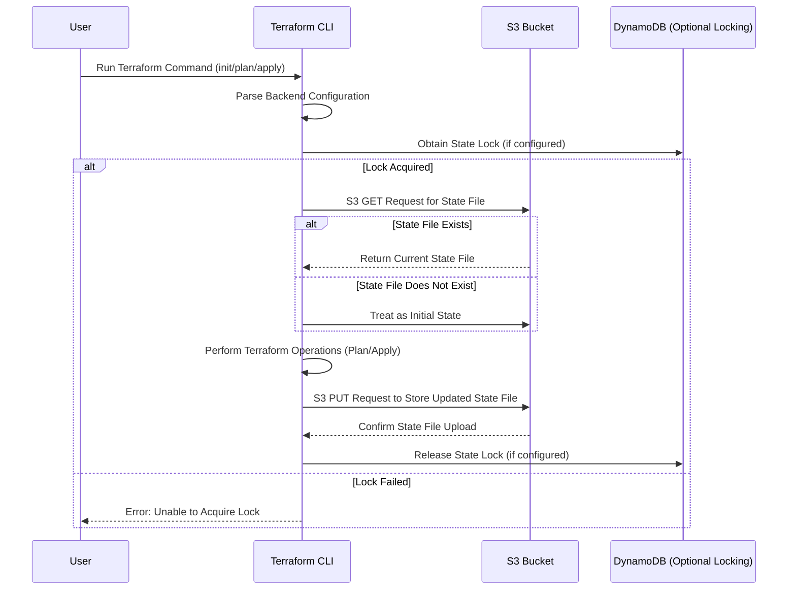
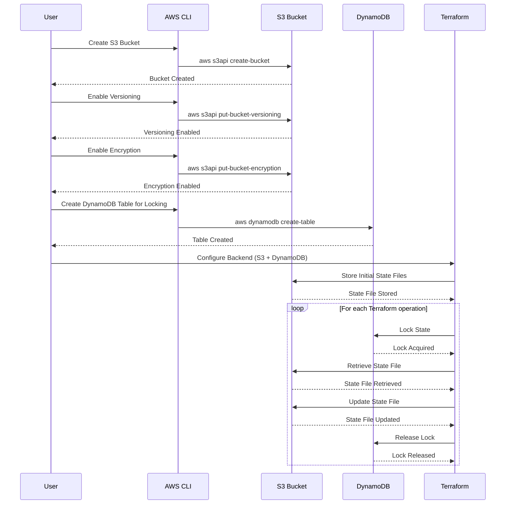

# Creating AWS Backend Resources for Terraform

Welcome to the guide for creating AWS backend resources to store and manage Terraform states. This document is designed to help you set up the necessary AWS resources that Terraform requires to store its state files, enabling team collaboration, versioning, and secure infrastructure management.

## Table of Contents

- [Introduction](#introduction)
- [Prerequisites](#prerequisites)
- [AWS Backend Resources Overview](#aws-backend-resources-overview)
- [Steps Overview](#steps-overview)
- [How Terraform Stores and Retrieves State Files from S3?](#how-terraform-stores-and-retrieves-state-files-from-s3)
- [How It Works?](#how-it-works)
- [Step-by-Step Guide](#step-by-step-guide)
   - [Step 1: Create an S3 Bucket](#step-1-create-an-s3-bucket)
   - [Step 2: Enable Versioning on the S3 Bucket](#step-2-enable-versioning-on-the-s3-bucket)
   - [Step 3: Enable Default Encryption on the S3 Bucket](#step-3-enable-default-encryption-on-the-s3-bucket)
   - [Step 4: Enable State Locking with DynamoDB](#step-4-enable-state-locking-with-dynamodb)
- [Best Practices](#best-practices)
- [Key Takeaways](#key-takeaways)
- [Conclusion](#conclusion)
- [References](#references)

## Introduction

Terraform is an open-source Infrastructure as Code (IaC) tool that allows you to build, change, and version your infrastructure safely and efficiently. When managing infrastructure with Terraform, state files are created to track the current state of the resources. These state files need to be stored securely and must be accessible by multiple users.

In this guide, we will:
- Create an AWS S3 bucket to store the Terraform state files.
- Enable Versioning on the S3 Bucket to keep track of changes in your state files.
- Enable Default Encryption on the S3 Bucket to secure your Terraform state files.
- Set up DynamoDB to lock the state file to prevent race conditions during concurrent updates.

By following this guide, you will ensure that your Terraform states are managed efficiently and securely in AWS.

## Prerequisites

Before you start, you will need:
- An AWS account with sufficient permissions to create S3 buckets and DynamoDB tables.
- You have [AWS CLI](https://aws.amazon.com/cli/) installed and configured with the necessary permissions.
- Terraform is installed. Follow [Terraform installation guide](https://learn.hashicorp.com/tutorials/terraform/install-cli) if needed.

## AWS Backend Resources Overview

Terraform uses a backend to store state files. The AWS S3 bucket will serve as the storage for your Terraform state, and a DynamoDB table will handle state locking to ensure that only one user can make changes to the state at a time.

### Why Use AWS S3 and DynamoDB?

- **S3**: Provides scalable and durable storage for state files.
- **DynamoDB**: Manages state locking, preventing race conditions during simultaneous Terraform runs.

### Key AWS Resources:

- **S3 Bucket**: Stores the state file.
- **DynamoDB Table**: Ensures state locking to prevent corruption from concurrent operations.

## How Terraform Stores and Retrieves State Files from S3?

Terraform uses an S3 bucket as a **remote backend** to store the state file, ensuring a centralized location where the current state of your infrastructure is stored. This allows multiple team members or processes to share the same infrastructure state.

### Sequence Diagram

Here is a sequence diagram to explain the process of how Terraform interacts with S3 to store and retrieve state files:



**Explanation**:

Here’s how the interaction with the S3 bucket works under the hood:

1. **Backend Configuration Parsing:**

- When you run a Terraform command (e.g., `terraform init`, `terraform apply`, or `terraform plan`), Terraform first reads the backend configuration in your `.tf` files, specifically looking for the S3 backend configuration.
- The configuration specifies the S3 bucket and other parameters such as the region and the key (the file path in the bucket).

Example configuration in Terraform:

```hcl
terraform {
  backend "s3" {
    bucket = "my-terraform-state-bucket"
    key    = "path/to/terraform.tfstate"
    region = "us-east-1"
  }
}
```

2. **Retrieving the State File (S3 GET Request):**

- **Step 1:** Before performing any operation (such as `terraform plan` or `terraform apply`), Terraform attempts to retrieve the current state file from the specified S3 bucket. It does this by making an **S3 GET request** using the bucket and key defined in the backend configuration.

- **Step 2:** Terraform checks if the state file exists in the S3 bucket. If it does, it downloads the file, parses it, and uses it to compare the current state of your infrastructure with the desired configuration in your `.tf` files.

- **Step 3:** If the state file doesn't exist (e.g., the first time you run Terraform for this configuration), Terraform treats this as an initial state, creating the infrastructure from scratch and saving the initial state to S3.

Example AWS CLI command that Terraform performs under the hood:

```bash
aws s3api get-object --bucket my-terraform-state-bucket --key path/to/terraform.tfstate terraform.tfstate
```

- This downloads the state file and ensures Terraform knows the current state of the infrastructure.

3. **Performing Terraform Operations:**

- Once the state is retrieved, Terraform uses it to perform various operations such as planning (`terraform plan`) or applying (`terraform apply`) infrastructure changes.

- During these operations, Terraform compares the desired state (described in your `.tf` files) with the current state (retrieved from the S3 bucket) and determines the necessary changes to bring the infrastructure to the desired state.

4. **Storing the Updated State File (S3 PUT Request):**

- **Step 1:** After performing the infrastructure changes (e.g., during a `terraform apply`), Terraform generates a new version of the state file that reflects the current state of the infrastructure after the changes.

- **Step 2:** Terraform then stores this updated state file back in the S3 bucket by making an **S3 PUT request**. The state file is uploaded to the same bucket and key that was specified in the backend configuration.

- **Step 3:** If versioning is enabled on the S3 bucket, Terraform stores multiple versions of the state file, allowing you to revert to previous versions if needed.

Example AWS CLI command that Terraform performs under the hood to store the updated state:

```bash
aws s3api put-object --bucket my-terraform-state-bucket --key path/to/terraform.tfstate --body terraform.tfstate
```

- This uploads the updated state to the S3 bucket, ensuring that the remote state is always in sync with the current infrastructure.

5. **Consistency and Locking:**

- While retrieving and storing the state, Terraform uses **DynamoDB state locking** (if configured) to ensure consistency. The locking mechanism prevents multiple Terraform processes from modifying the state file simultaneously, which could lead to inconsistencies or corruption.

6. **State Encryption and Security:**

- **SSE (Server-Side Encryption):** If you have configured encryption for your S3 bucket, Terraform automatically stores the state file in an encrypted format. This ensures that sensitive information in the state file (like credentials, resource metadata) is protected.
- **Bucket Policies and Access Control:** Terraform relies on the configured IAM policies to interact with the S3 bucket. These policies should grant Terraform permissions to perform `GetObject`, `PutObject`, and `ListBucket` operations on the specified S3 bucket.

### Failures and Recovery

If Terraform fails to retrieve the state file (e.g., due to network issues or misconfiguration), it will stop and report an error, preventing further operations. Similarly, if Terraform cannot upload the updated state to S3 after an operation, it will not mark the operation as successful, ensuring that the state file remains consistent with the infrastructure.

### Summary of Terraform’s Interaction with S3

- **Retrieving the State (S3 GET):** Terraform reads the current state from the S3 bucket before performing any operations.
- **Storing the Updated State (S3 PUT):** After operations are completed, Terraform updates the state file in the S3 bucket.
- **State Encryption:** The state file can be encrypted for security, and IAM roles ensure that only Terraform has access to it.
- **Locking:** DynamoDB is often used alongside S3 to lock the state file during operations, preventing multiple processes from making concurrent changes.

## How It Works?

The following sequence diagram outlines the process of setting up and using S3 and DynamoDB for Terraform state management:



**Explanation**:

1. **User creates the S3 bucket**: The user issues a command via AWS CLI to create the S3 bucket for storing Terraform state files.
2. **Enable versioning**: The user enables versioning on the S3 bucket to track changes to the state files.
3. **Enable encryption**: The user enables default encryption for the bucket to ensure that state files are securely stored.
4. **Create DynamoDB table**: The user creates a DynamoDB table that will manage state locking to ensure that only one Terraform process can modify the state at a time.
5. **Configure Terraform backend**: The user configures the Terraform backend to use the S3 bucket and DynamoDB for state management and locking.
6. **Terraform interacts with S3 and DynamoDB**:
    - It stores and retrieves state files from the S3 bucket.
    - It locks and unlocks the state file using DynamoDB during the execution of operations to ensure no other process can interfere.

## Steps Overview

1. Create an S3 bucket to store Terraform state files.
2. Enable versioning for the S3 bucket to track state file changes.
3. Enable default encryption for the S3 bucket to secure state files.
4. Set up DynamoDB for state locking to prevent concurrent state modifications.

## Step-by-Step Guide

This guide walks through the steps of setting up an S3 bucket for storing Terraform state files and a DynamoDB table for state locking. The following values will be used in this tutorial, but you can replace them with your own:

- **S3 bucket name:** `kite-terraform-tf-state`
- **AWS region:** `us-east-1`
- **DynamoDB table name:** `kite-tf-lock`

### Step 1: Create an S3 Bucket

The S3 bucket will store the Terraform state file.

Run the following command to create the S3 bucket:

```bash
aws s3api create-bucket --bucket <your-bucket-name> --region <your-region>
```

**Note**:

- Ensure the bucket name is globally unique.
- Replace `<your-bucket-name>` with your desired bucket name.
- Replace `<your-region>` with your preferred AWS region.

In this tutorial, I'm using the bucket name `kite-terraform-tf-state` and my AWS region is `us-east-1`:

```bash
aws s3api create-bucket --bucket kite-terraform-tf-state --region us-east-1
```
  
### Step 2: Enable Versioning on the S3 Bucket

Versioning helps keep track of changes in your state files.

Run the following command to enable versioning on the S3 bucket:

```bash
aws s3api put-bucket-versioning --bucket <your-bucket-name> --versioning-configuration Status=Enabled
```

This command configures the S3 bucket to store multiple versions of your state file, providing an additional layer of safety.

For this tutorial, versioning will be enabled on the bucket `kite-terraform-tf-state`:

```bash
aws s3api put-bucket-versioning --bucket kite-terraform-tf-state --versioning-configuration Status=Enabled
```

### Step 3: Enable Default Encryption on the S3 Bucket

To secure your Terraform state files, enable default encryption using the following command:

```bash
aws s3api put-bucket-encryption --bucket <your-bucket-name> --server-side-encryption-configuration '{
  "Rules": [
    {
      "ApplyServerSideEncryptionByDefault": {
        "SSEAlgorithm": "AES256"
      }
    }
  ]
}'
```

This command will set up default encryption using AWS-managed keys (SSE-S3, which uses AES-256 encryption).

For this tutorial, the S3 bucket `kite-terraform-tf-state` will use AES-256 encryption (SSE-S3):

```bash
aws s3api put-bucket-encryption --bucket kite-terraform-tf-state --server-side-encryption-configuration '{
  "Rules": [
    {
      "ApplyServerSideEncryptionByDefault": {
        "SSEAlgorithm": "AES256"
      }
    }
  ]
}'
```

### Step 4: Enable State Locking with DynamoDB

State locking ensures that only one Terraform process can modify the infrastructure at any time.

Create a DynamoDB table to manage state locks:

```bash
aws dynamodb create-table \
    --table-name <your-lock-table-name> \
    --attribute-definitions AttributeName=LockID,AttributeType=S \
    --key-schema AttributeName=LockID,KeyType=HASH \
    --provisioned-throughput ReadCapacityUnits=5,WriteCapacityUnits=5
```

This command creates a table with a primary key named `LockID` that will handle state locking.

**Note**: Replace `<your-lock-table-name>` with your desired table name.

For this tutorial, the DynamoDB table name will be `kite-tf-lock`:

```bash
aws dynamodb create-table \
    --table-name kite-tf-lock \
    --attribute-definitions AttributeName=LockID,AttributeType=S \
    --key-schema AttributeName=LockID,KeyType=HASH \
    --provisioned-throughput ReadCapacityUnits=5,WriteCapacityUnits=5
```

## Best Practices

- **Use Versioning**: Always enable versioning in your S3 bucket to keep a history of your state file changes.
- **Enable Encryption**: Ensure your S3 bucket and DynamoDB tables are encrypted to protect sensitive information in your state files.
- **State Locking**: Use DynamoDB to manage state locking to prevent issues during concurrent operations.
- **IAM Policies**: Restrict access to your S3 bucket and DynamoDB table using IAM policies to ensure only authorized users can modify your Terraform state.

## Key Takeaways

- Storing Terraform state files in S3 ensures that state is centralized and accessible to all team members.
- Enabling DynamoDB for state locking prevents concurrent modifications that can corrupt your Terraform state.
- Using best practices such as encryption, versioning, and access controls enhances the security and reliability of your infrastructure.

## Conclusion

By following this guide, you have successfully created the necessary AWS resources to manage your Terraform state securely and efficiently. You’ve set up an S3 bucket for state storage, configured DynamoDB for state locking, and integrated these resources into your Terraform backend configuration. This setup ensures that your infrastructure management is scalable, secure, and collaborative.

## References

- [AWS S3 Documentation](https://docs.aws.amazon.com/s3/index.html)
- [Backend Type: s3 | Terraform](https://developer.hashicorp.com/terraform/language/backend/s3)
- [AWS DynamoDB Documentation](https://docs.aws.amazon.com/dynamodb/index.html)
- [Best practices for using the Terraform AWS Provider](https://docs.aws.amazon.com/prescriptive-guidance/latest/terraform-aws-provider-best-practices/introduction.html)