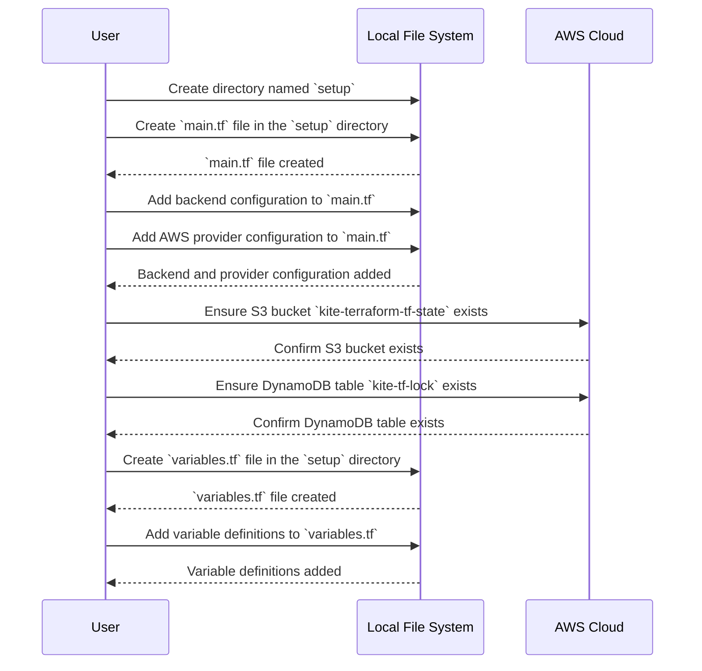
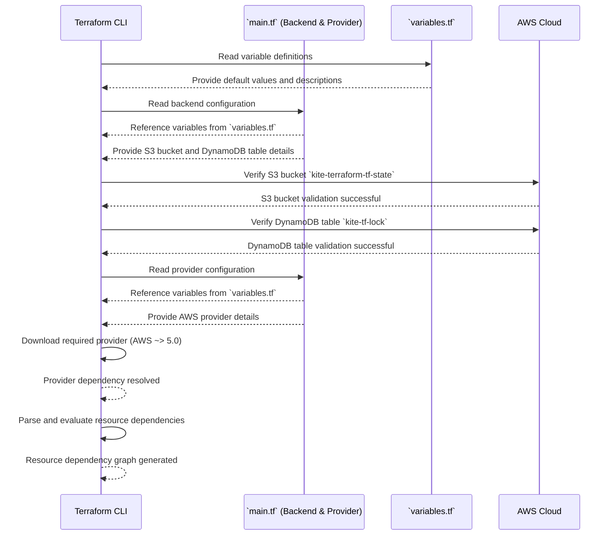

# Configuring Setup Terraform

Welcome to this step-by-step guide for setting up Terraform on your local machine. This document is designed to help you understand the basics of Terraform configuration and implement a setup specifically for managing AWS resources.

## Table of Contents

- [Introduction to Terraform](#introduction-to-terraform)
- [Hands-On Roadmap](#hands-on-roadmap)
- [Terraform Dependencies](#terraform-dependencies)
- [Setting Up Terraform](#setting-up-terraform)
    - [Creating the `main.tf` File](#creating-the-main-tf-file)
    - [Configuring the Backend](#configuring-the-backend)
    - [Adding a Provider](#adding-a-provider)
- [Defining Variables](#defining-variables)
- [Best Practices](#best-practices)
- [Key Takeaways](#key-takeaways)
- [Conclusion](#conclusion)
- [References](#references)

## Introduction

This guide focuses on setting up Terraform for AWS projects using an S3 bucket for state management and DynamoDB for state locking.

## Hands-On Roadmap



## Terraform Dependencies



### Explanation:

1. **Read Variables**:

- Terraform starts by reading the `variables.tf` file to load default values and descriptions.

2. **Backend Configuration**:

- Terraform reads the backend configuration from `main.tf`.
- It references variables (`kite-terraform-tf-state`, `kite-tf-lock`, `key`) from `variables.tf` and resolves them.
- Backend dependencies (S3 bucket and DynamoDB table) are validated with AWS.

3. **Provider Configuration**:

- Terraform reads the provider configuration from `main.tf`.
- Variables (`project`, `contact`) from `variables.tf` are resolved and used to populate the provider's configuration.

4. **Provider Dependency Management**:

- Terraform downloads the required AWS provider as defined in `main.tf`.

5. **Dependency Parsing**:

- Terraform parses all configurations and evaluates resource dependencies, building a dependency graph.

## Setting Up Terraform

### Creating the `main.tf` File

Start by creating a new directory named `setup`. Inside this directory, create a file named `main.tf` and add the following configuration:

```hcl
terraform {
  required_providers {
    aws = {
      source  = "hashicorp/aws"
      version = "~> 5.0"
    }
  }
}
```

This step is configuring Terraform to use the AWS provider.

**Code Breakdown**:

1. **`terraform {}` Block**:

- This block contains settings and configuration options for Terraform itself.
- It can include required provider configurations, backend settings, or CLI options.

2. **`required_providers`**:

- This argument specifies the providers that Terraform will use in the configuration.
- Providers are plugins that enable Terraform to manage specific resources (e.g., AWS, Azure, GCP).

3. **`aws = {}`**:

- The `aws` key specifies the AWS provider. This is the provider Terraform will use to interact with AWS services (e.g., EC2, S3, RDS).
- The value is a block defining the provider's **source** and **version**.

4. **`source = "hashicorp/aws"`**:

- The `source` attribute specifies the location of the provider plugin.
- `"hashicorp/aws"` means the provider is published and maintained by HashiCorp on the Terraform Registry.

5. **`version = "~> 5.0"`**:

- The `version` attribute specifies the version constraints for the AWS provider.
- `~> 5.0` means the configuration is compatible with any **5.x** version of the provider, as long as the major version (5) remains the same. For example, it allows `5.0.1`, `5.1.0`, etc., but not `6.0.0`.

### Configuring the Backend

Update the backend configuration in `main.tf` as shown below:

```hcl
terraform {
  required_providers {
    aws = {
      source  = "hashicorp/aws"
      version = "~> 5.0"
    }
  }

  backend "s3" {
    bucket         = "kite-terraform-tf-state"
    key            = "kite-state-setup"
    region         = "us-east-1"
    encrypt        = true
    dynamodb_table = "kite-tf-lock"
  }
}
```

The backend defines where Terraform stores its state files. In this example:

- **S3 Bucket**: `kite-terraform-tf-state` stores the Terraform state file.
- **Key**: `kite-state-setup` ensures states for different environments are stored separately.
- **DynamoDB Table**: `kite-tf-lock` handles state locking to prevent conflicts.

Ensure these resources exist in your AWS account.

### Adding a Provider

Terraform providers are plugins that interact with cloud services. Add the AWS provider configuration to your `main.tf` file:

```hcl
provider "aws" {
  region = "us-east-1"
  default_tags {
    tags = {
      environment = terraform.workspace
      project     = var.project
      contact     = var.contact
      managed_by  = "Terraform/setup"
    }
  }
}
```

## Defining Variables

Variables allow you to reuse and share configurations easily. In the `setup` directory, create a file named `variables.tf` and define the following:

```hcl
variable "kite-terraform-tf-state" {
  description = "The name of the S3 bucket for the backend"
  type        = string
  default     = "kite-terraform-tf-state"
}

variable "kite-tf-lock" {
  description = "The name of the DynamoDB table for state locking"
  type        = string
  default     = "kite-tf-lock"
}

variable "key" {
  description = "The path to the state file inside the bucket"
  type        = string
  default     = "kite-state-setup"
}

variable "project" {
  description = "The name of the project"
  type        = string
  default     = "kientree-terraform-project"
}

variable "contact" {
  description = "The contact person for the project"
  type        = string
  default     = "your-email@example.com"
}
```

## Best Practices

- **Pin Provider Versions**: Specify exact provider versions to avoid unexpected behavior.
- **Use Remote State**: Store your Terraform state in a remote backend (e.g., S3) to enable collaboration.
- **Tag Your Resources**: Use default tags to improve resource visibility and cost tracking.
- **Secure Backend Resources**: Encrypt state files and lock state with DynamoDB to prevent conflicts.

## Key Takeaways

- Proper backend configuration ensures state files are secure and conflict-free.
- Variables and tags enhance reusability and maintainability.

## Conclusion

Setting up Terraform for your project involves defining providers, configuring a backend, and using variables effectively. By following this guide, you’ve established a foundation for managing your AWS resources efficiently with Terraform.

## References

- [Terraform AWS Provider Documentation](https://registry.terraform.io/providers/hashicorp/aws/latest/docs)
- [Terraform Backend Configuration](https://developer.hashicorp.com/terraform/language/backend/s3)
- [Default Tags in Terraform](https://registry.terraform.io/providers/hashicorp/aws/latest/docs#default_tags)